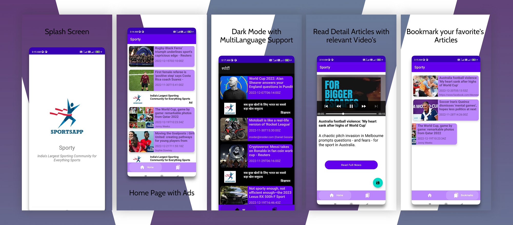

# Sporty

# Features
* 📌Accessing local database using Room
* 📌Making network API calls to fetch data using Retrofit
* 📌 Dependency Injection using Dagger - Hilt
* 📌 MVVM architecture
* 📌 Displaying list with multiple view types using RecyclerView.
* 📌 Displaying Images from URLs using Glide
* 📌 Playing Videos from URLs using Exoplayer
* 📌 Dark Theme + Localization 

# ScreenShots
 
